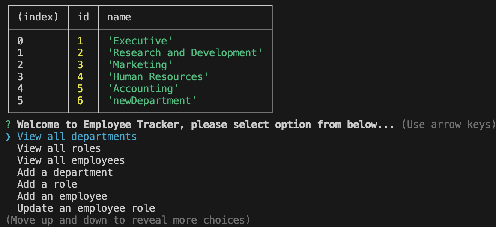

<h1 id="title">ReadMe file for "A Unique Employee Database"</h1>
<h3>By User davehyler</h3>
<!-- Optional Screenshot will show if user places one within the same directory as this readme. -->

 
<a href = "https://app.screencastify.com/v3/watch/fjwlHusZajvKNWcCvS8n">Video Walkthrough</a> 
<nav>
<h2>Table Of Contents</h2>
<ol>
<li><a href="#title">Title</a></li>
<li><a href="#username">Username</a></li>
<li><a href="#email">Email</a></li>
<li><a href="#stack">Stack</a></li>
<li><a href="#license">License</a></li>
<li><a href="#description">Description</a></li>
<li><a href="#instructions">Installation Instructions</a></li>
<li><a href="#usage">Usage</a></li>
<li><a href="#guidelines">Guidelines</a></li>
<li><a href="#testing">Testing</a></li>
</ol>
</nav>
<ul class="list-group">
<h2>Project Information</h2>
<h3 id="stack">Stack used:</h3>

<h3 id="license">License: MIT</h3>

Badge: 

<h3 id="description">Description of project:</h3>

A simple node based script that will pull employee data from an SQL File with the data of your choosing. Once in the application, you can further manipulate this data by adding/changing employees, roles, departments, and even salaries.

<h3 id="instructions">Installation Instructions:</h3>

Make sure to install any dependancies (see package.json in same directory) prior to attempting to run, then within your terminal running within the directory of "generatelogo.js", type the command "node generatelogo.js" to begin and follow the prompts.

<h3 id="usage">How to use:</h3>

//STEPS -  
  PREREQUISITE: Make sure to change the USER specified within the schema file. Had initially not specified a user, but received direct instruction from the teaching staff to enter the specified DATABASE and USER in order to prevent errors my system was giving for a soft error that had no effect on the execution of the program.
1: Open Terminal in database folder, type: "psql -U userNameHere employee_db",  
2: Type \i schema.sql // this will already have the connection "\c employee_db" command embedded within the schema as well as the SEEDS (as they are static and do not require a seeds file, whereas managing multiple companies would benefit from a seeds file), do not need a manual "connection" command or separate seed file to use database) 
3: Open Second Terminal in root folder of JS file, run "Node index.js" (ensure dependancies "inquirer@8.2.4" and postgres' "pg" have been met via the "npm i _____" command prior to executing EmployeeTracker) 

<h3 id="guidelines">Guidelines for Contribution:</h3>

Make sure all submissions are compatible with the current codebase.

</ul>
<h3>Questions? Contact Me:</h3>
<ul class="list-group">
<li class="list-group-item">GitHub username: davehyler</li>
<li class="list-group-item">Email:  davehyler@github.com (placeholder, do not use. Will not post personal information on assignments present on publicly scrapable websites)</li>
</ul>
